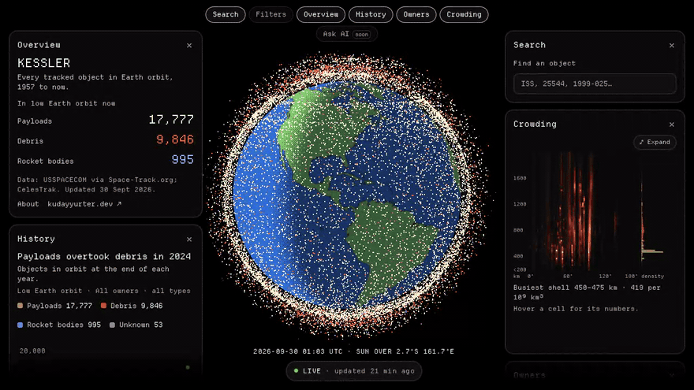
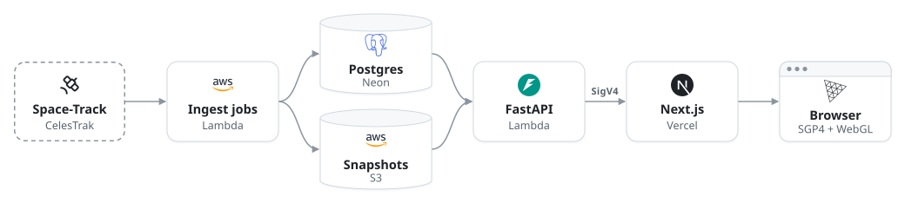

<div align="center">

# Kessler

**Every tracked object in Earth orbit, 1957 to now.**

[Live site](https://kessler.kudayyurter.dev) · [How it works](#how-it-works) · [Run locally](#run-locally)



</div>

Kessler puts about 30,000 objects in orbit on a live 3D globe, each placed at its real position, next to charts of how the sky got crowded. It's built from the full public catalog and refreshed several times a day. The name comes from Donald Kessler, the NASA scientist who in 1978 described how collisions in a crowded orbit could cascade into more debris.

## What it does

- **Live globe:** payloads, debris and rocket bodies propagated with SGP4 in your browser, with the real Sun's day/night line and name labels when you zoom in.
- **Search:** find any object by name, NORAD ID or international designator (`ISS`, `25544`, `1999-025…`) and fly to it.
- **History and owners:** animated charts of objects in orbit each year since 1957, overall and by owner.
- **Crowding:** a density map by altitude and inclination that shows the busiest shells, how they change day to day, and why.
- **Filters:** narrow by object type, orbit and owner. Filters apply to the globe and to every chart.

## How it works

<p align="center">
  
  
  
  
  
  
  
  
  
</p>

<picture>
  <source media="(prefers-color-scheme: dark)" srcset=".github/assets/architecture-dark.svg">
  
</picture>

- **Consistent snapshots:** each catalog ingest publishes an immutable snapshot generation, so a page's positions and names always come from the same data.
- **Checked accuracy:** CI tests every step from snapshot to SGP4 to globe against an independent Python reference. A daily capture and a weekly review also compare the live site against that reference and the ISS's reported position ([details](web/README.md#accuracy)).
- **Private origin:** the API's Function URL requires IAM auth. The Vercel proxy signs each request with short-lived credentials from OIDC, so no AWS keys are stored.

## Run locally

You need Docker, [uv](https://docs.astral.sh/uv/) and Node 22. Space-Track credentials in `api/.env` are optional. Without them, the element-set ingest uses CelesTrak's active satellites only.

```bash
# Terminal 1: database, first data load (~1–2 min), API on :8000
cd api
cp .env.example .env
docker compose up -d db
uv sync && uv run --env-file .env alembic upgrade head
uv run python -m app.jobs all
uv run uvicorn app.api.main:create_app --factory --port 8000
```

```bash
# Terminal 2: the site on http://localhost:3000
cd web
cp .env.example .env.local
npm install && npm run dev
```

Tests, jobs and deployment are covered in [`api/README.md`](api/README.md), [`web/README.md`](web/README.md) and [`infra/README.md`](infra/README.md); the go-live runbook is [`docs/deploy.md`](docs/deploy.md).

## Credits and license

This started as *Space Debris and Objects in LEO*, a MATLAB App Designer project that won 1st place, by Brian Alino, Meena Al Hasani, Gregory Maddox, Vedant Patel, Jessica Semaan and Kuday Yurter ([`matlab/`](matlab/)). Data from USSPACECOM via Space-Track.org and from CelesTrak. [MIT](LICENSE) © 2026 Kuday Yurter.
